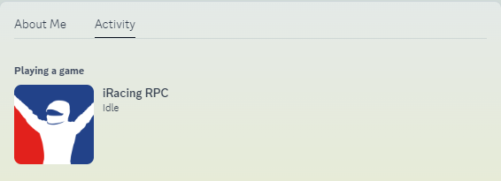
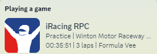
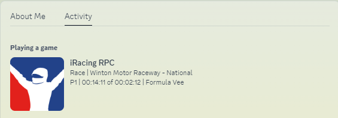

<p align="center">
  
</p>
<p align="center">
  <a href="https://opensource.org/licenses/GPL-3.0">
    
  </a>
</p>


# iRacing Rich Presence

Discord Rich Presence for iRacing sessions using python.


## Features

- Display current session, position, laps, current track name and car name.
- Lightweight
- Customizable settings

## Gallery

<table>
  <tr>
    <td align="center">
      
      <br>
      <em>Idle</em>
    </td>
    <td align="center">
      
      <br>
      <em>Practice</em>
    </td>
  </tr>
      <td align="center">
      
      <br>
      <em>Racing</em>
    </td>
  </tr>
</table>

## Installation

1. Ensure Python 3.12.4 or later is installed.

2. Clone the repository ```git clone https://github.com/OutdatedDev/iRacingRPC```

3. Navigate to the project directory ``` cd iRacingRPC```

4. Install the required dependencies ```pip install -r requirements.txt```

5. Run the application ```py main.py```

## Acknowledgements

 - [pyirsdk](https://github.com/kutu/pyirsdk)
  - [pystray](https://github.com/moses-palmer/pystray)
  - [pypresence](https://pypi.org/project/pypresence/)
 - [Pillow](https://github.com/python-pillow/Pillow)


